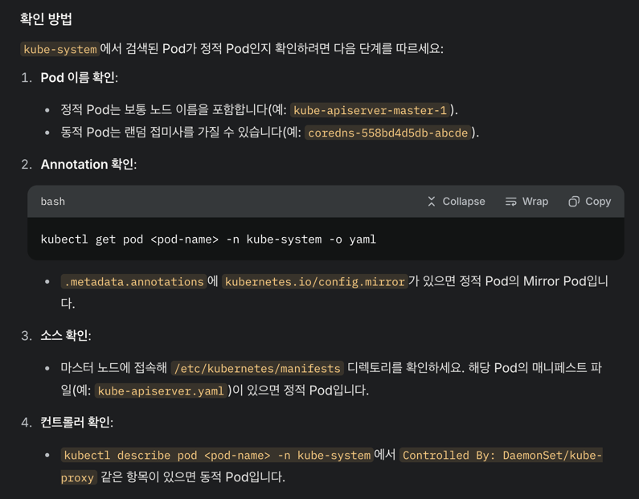
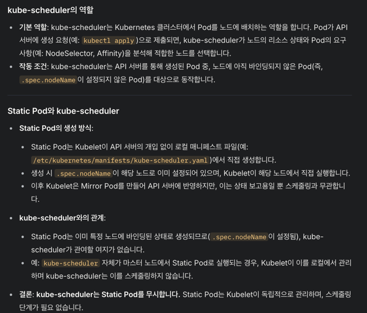
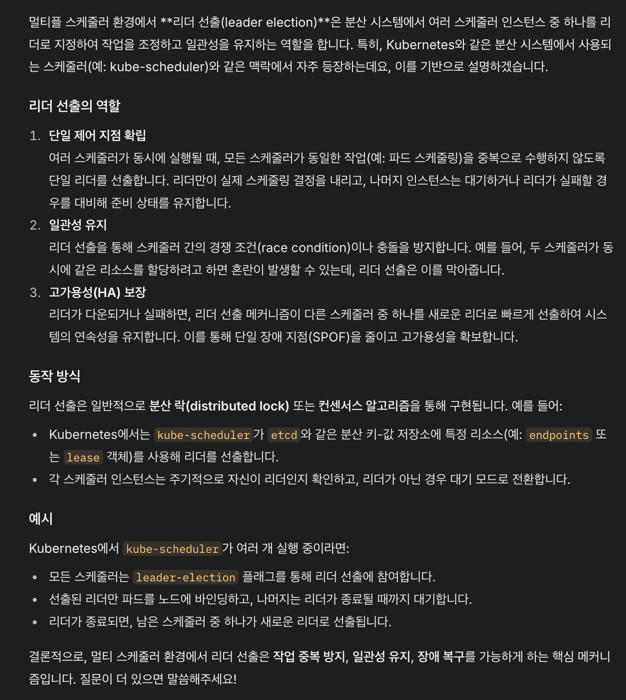
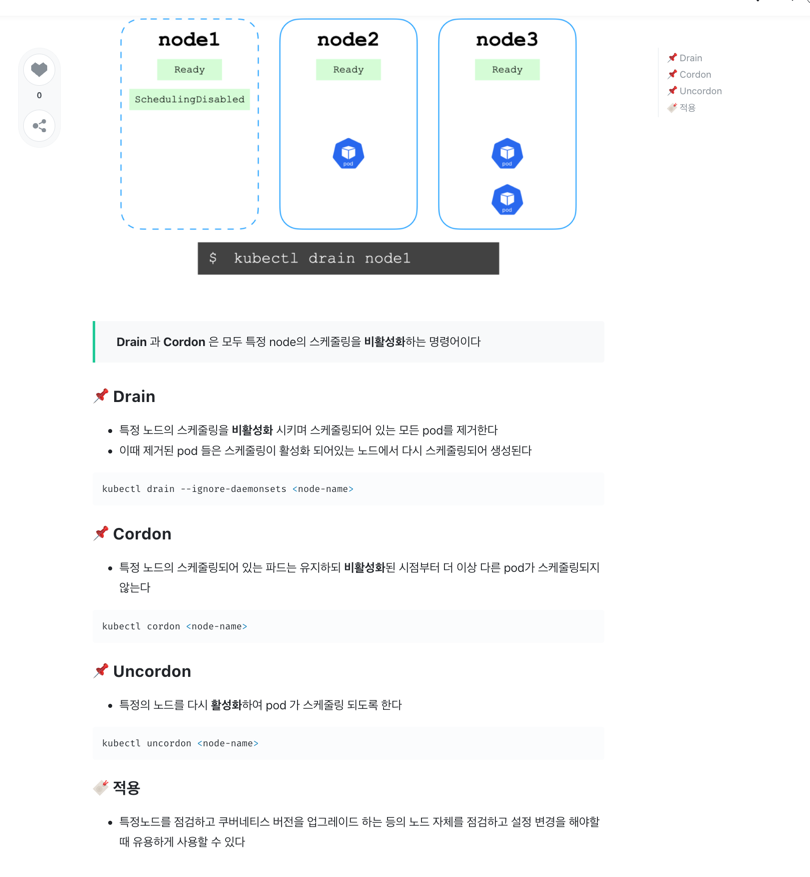
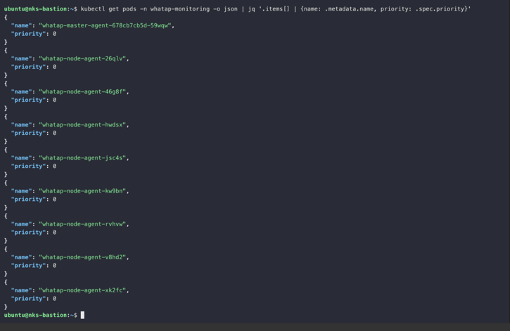
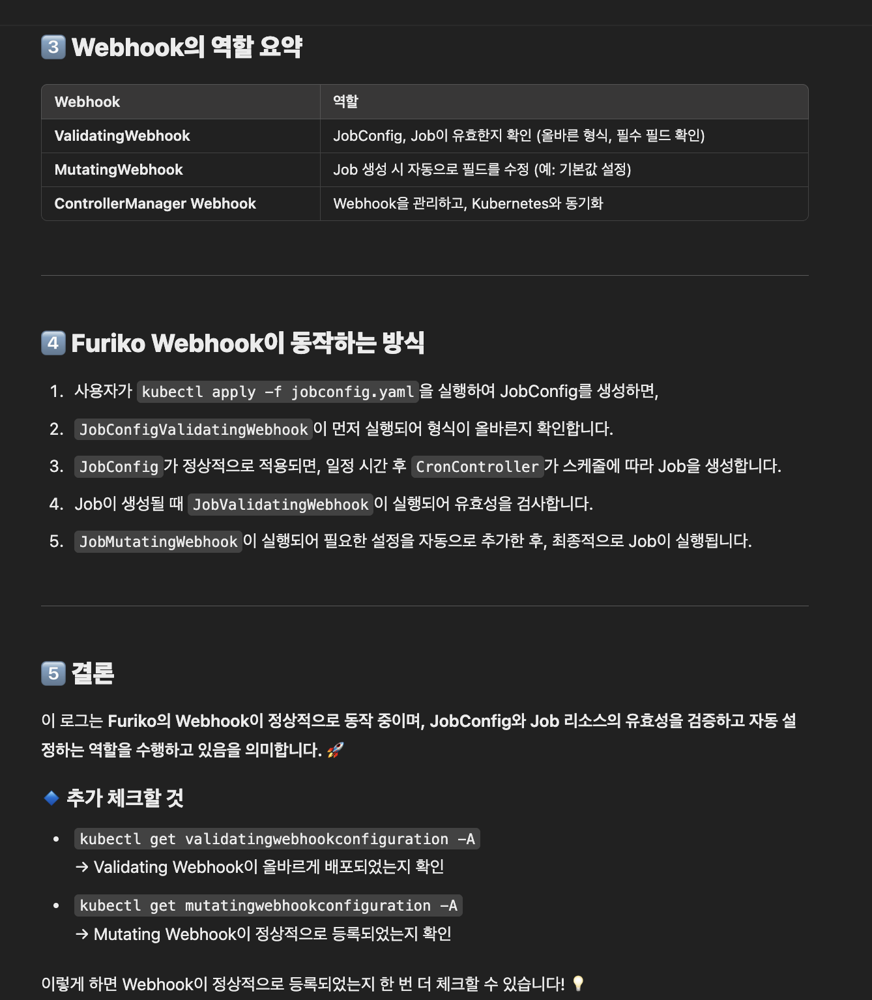

```python
import base64
import copy
import http
import json
import random

import jsonpatch
from flask import Flask, jsonify, request

app = Flask(__name__)


@app.route("/validate", methods=["POST"])
def validate():
    allowed = True
    try:
        for container_spec in request.json["request"]["object"]["spec"]["containers"]:
            if "env" in container_spec:
                allowed = False
    except KeyError:
        pass
    return jsonify(
        {
            "response": {
                "allowed": allowed,
                "uid": request.json["request"]["uid"],
                "status": {"message": "env keys are prohibited"},
            }
        }
    )


@app.route("/mutate", methods=["POST"])
def mutate():
    spec = request.json["request"]["object"]
    modified_spec = copy.deepcopy(spec)

    try:
        modified_spec["metadata"]["labels"]["example.com/new-label"] = str(
            random.randint(1, 1000)
        )
    except KeyError:
        pass
    patch = jsonpatch.JsonPatch.from_diff(spec, modified_spec)
    return jsonify(
        {
            "response": {
                "allowed": True,
                "uid": request.json["request"]["uid"],
                "patch": base64.b64encode(str(patch).encode()).decode(),
                "patchtype": "JSONPatch",
            }
        }
    )


@app.route("/health", methods=["GET"])
def health():
    return ("", http.HTTPStatus.NO_CONTENT)


if __name__ == "__main__":
    app.run(host="0.0.0.0", debug=True)  # pragma: no cover

```

```markdown
Edit a POD
Remember, you CANNOT edit specifications of an existing POD other than the below.

spec.containers[*].image

spec.initContainers[*].image

spec.activeDeadlineSeconds

spec.tolerations

For example you cannot edit the environment variables, 
service accounts, resource limits (all of which we will discuss later) of a running pod. But if you really want to, you have 2 options:

1. Run the kubectl edit pod <pod name> command.

2. The second option is to extract the pod definition in YAML format to a file using the command
`kubectl get pod webapp -o yaml > my-new-pod.yaml`
```

### 4. Static PODs
- 정적 pod vs 동적 pod 구분하는 법

- 정적 pod vs 데몬셋으로 생성한 pod


#### 5. multiple scheduler

- Lease
- https://netmarble.engineering/k8s-pod-clustering-lease-and-hazelcast/
- 

- https://velog.io/@moonblue/%EC%BF%A0%EB%B2%84%EB%84%A4%ED%8B%B0%EC%8A%A4-Drain-VS-Cordon
- https://github.com/garethr/kubernetes-webhook-examples/blob/master/src/app.py
- https://coffeewhale.com/kubernetes/admission-control/2021/04/28/opa1/

- https://github.com/kubernetes/enhancements/tree/master/keps/sig-scheduling/1451-multi-scheduling-profiles
- https://github.com/kubernetes/enhancements/blob/master/keps/sig-scheduling/624-scheduling-framework/README.md
- https://stackoverflow.com/questions/28857993/how-does-kubernetes-scheduler-work
- https://jvns.ca/blog/2017/07/27/how-does-the-kubernetes-scheduler-work/
- https://kubernetes.io/blog/2017/03/advanced-scheduling-in-kubernetes/
- https://github.com/kubernetes/community/blob/master/contributors/devel/sig-scheduling/scheduling_code_hierarchy_overview.md




- 
- 
- https://kyverno.io/docs/introduction/how-kyverno-works/#kubernetes-admission-controls
- https://devocean.sk.com/experts/techBoardDetail.do?ID=163561
- PSS
- https://kschoi728.tistory.com/115

# 아키텍쳐 잘 나와 있음
https://www.simform.com/blog/kubernetes-architecture/

# docker capabilities
- https://stackoverflow.com/questions/63162665/docker-compose-order-of-cap-drop-and-cap-add
- https://docs.docker.com/engine/containers/run/#runtime-privilege-and-linux-capabilities
- https://opentutorials.org/module/4850/32261
# k8s configure-pod-container/security-context/#set-capabilities-for-a-container
- https://kubernetes.io/docs/tasks/configure-pod-container/security-context/#set-capabilities-for-a-container

# k8s api conventions